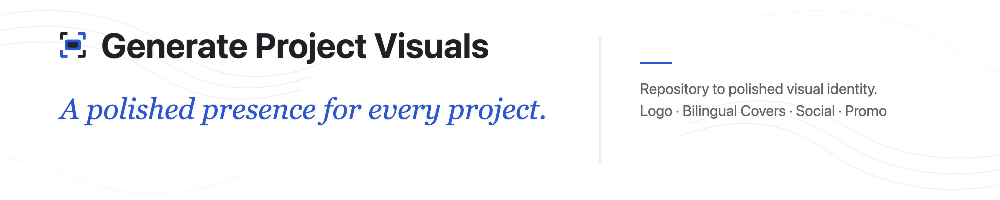

# Generate Project Visuals

> 中文说明：[README.zh-CN.md](README.zh-CN.md)

<p align="center">
  <a href="LICENSE"></a>
  <a href="https://github.com/ascendho/Generate-Project-Visuals/releases/latest"></a>
  <a href="https://github.com/ascendho/Generate-Project-Visuals/stargazers"></a>
  <a href="https://github.com/ascendho/Generate-Project-Visuals/commits/master"></a>
  <a href=".github/workflows/release.yml"></a>
  <a href="plugins/generate-github-cover/skills/generate-github-cover/SKILL.md"></a>
</p>

<p align="center">
  
</p>

Generate Project Visuals is a Codex Plugin and standalone Skill that reads a
repository and creates its Logo Mark and Logo Lockup plus an English README
Cover, `1280x640` Social Preview, and `16:9` Promo image. Every public image is
exported as PNG at an exact size; SVG is limited to bundled templates and
temporary Logo concepts. Additional or alternative languages are generated
only when explicitly requested or already configured.

The project brand is **Generate Project Visuals**. The stable Plugin, Skill,
and invocation name remains `generate-github-cover`.

## How it works

1. The Skill reads repository guidance, documentation, metadata, entry points,
   configuration, and existing visuals to determine the project's positioning.
2. It creates three temporary Logo Mark directions outside the repository and
   presents them for the user to choose from.
3. After the user selects a direction, it renders and validates the final Logo
   Mark and Logo Lockup.
4. It writes an editable Cover configuration, then renders and validates the
   README Cover, Social Preview, and Promo images in English by default or in
   the explicitly requested languages.

## Install

The renderer requires Python 3.10+, Playwright, Segno, and Chromium. The
examples use `python3`, the usual executable on macOS and Linux; `python` is
also valid when it resolves to Python 3.10 or later.

```sh
python3 -m pip install "playwright==1.61.0" "segno==1.6.6"
python3 -m playwright install chromium
```

Before it creates or renders assets, the Skill checks the Python packages and
Chromium runtime. It reports exact remediation commands when something is
missing and never installs dependencies without approval.

### Codex Plugin (recommended)

```sh
codex plugin marketplace add ascendho/Generate-Project-Visuals --ref master
codex plugin add generate-github-cover@generate-project-visuals
```

The first command registers this GitHub repository as a marketplace source;
the second installs the Plugin from that source. This does not require a
listing in the public Plugins Directory. Start a new Codex thread after
installation, then invoke `$generate-github-cover` or describe a matching
visual-generation task.

### Release archive (standalone fallback)

Download `generate-github-cover-vX.Y.Z.zip` from the
[latest Release](https://github.com/ascendho/Generate-Project-Visuals/releases/latest),
verify its `.sha256` file, and extract it into the user Skill directory:

```sh
shasum -a 256 -c generate-github-cover-vX.Y.Z.zip.sha256
mkdir -p "$HOME/.agents/skills"
unzip generate-github-cover-vX.Y.Z.zip -d "$HOME/.agents/skills"
```

Cloning the whole repository is intended for development. Repository READMEs,
workflow files, and showcase artwork are deliberately not included in the
standalone Skill archive.

### Customize styles

The extracted Skill is editable. To create a style for your own visual needs,
copy the existing
[Cover style](plugins/generate-github-cover/skills/generate-github-cover/styles/cover/clean-editorial/)
or [Logo style](plugins/generate-github-cover/skills/generate-github-cover/styles/logo/clean-geometric/)
to a new lowercase hyphenated style ID, then update its manifest, reference,
and, for Cover styles, SVG templates. Valid styles are discovered automatically;
request the new ID in your prompt or set it as `cover_style` or `logo_style` in
the Cover JSON. See the [style-authoring guide](plugins/generate-github-cover/skills/generate-github-cover/references/style-authoring.md)
for the required files and contracts.

Keep custom styles in your own fork or a separately managed Skill copy because
Plugin upgrades and reinstalls may replace installed files.

## Use

```text
Use $generate-github-cover to create or update this GitHub project's Logo and English Cover, Social Preview, and Promo images.
```

The Skill reads repository guidance, READMEs, package metadata, entry points,
configuration, and existing visuals before writing copy or choosing visual
metaphors. It generates files only unless the user explicitly requests README,
GitHub settings, commit, or remote updates.

When no language is requested, the Skill generates only English. An explicit
locale set replaces that default; ask to add or retain languages when existing
locales should remain. English uses unsuffixed filenames by default, while
Simplified Chinese uses `-zh` when English remains the default locale.

## Cover specification

The Skill creates `assets/<repo-slug>-cover.json` as the editable source of
truth for generated artwork. Top-level fields hold project identity and style
selection, while `locales` holds all translatable Cover, Social Preview, and
Promo copy. It is generated automatically, so users do not need to create it
before invoking the Skill. See the [English-only example](examples/cover-config.en.json)
or [English and Simplified Chinese example](examples/cover-config.en-zh.json)
for the complete schema.

To revise generated copy, edit `headline`, the two `description_lines`,
`notice`, or `cta` under the relevant locale, then rerun `render --force` and
`validate`. Template changes are not required for copy edits. Every locale must
remain complete, and each `description_lines` array must contain exactly two
strings.

`source_files` is provenance: list only repository-relative files that were
actually read and used. It does not make the renderer load those files. Exclude
secrets, caches, generated output, and unrelated files.

Cover is a compact `5:1` README banner rendered at `4000x800`. Keep its two
supporting lines short for the right column. Optional `social_preview` copy
uses the same shape and falls back to `cover`; use it when the unchanged
`1280x640` Social Preview needs longer wording.

## Edit copy and regenerate

The Skill normally writes the configuration and runs the renderers for you. If
the generated copy needs work, ask the Skill to revise and regenerate it, or
edit the relevant locale in `assets/<repo-slug>-cover.json` yourself. Users of
the standalone Release archive can then run:

```sh
SKILL_DIR="$HOME/.agents/skills/generate-github-cover"

python3 "$SKILL_DIR/scripts/render_cover.py" render \
  assets/<repo-slug>-cover.json --output-dir assets --force

python3 "$SKILL_DIR/scripts/render_cover.py" validate \
  assets/<repo-slug>-cover.json --output-dir assets
```

`--force` intentionally replaces the existing generated PNGs. `validate`
checks the expected files and exact dimensions. The default locale uses
unsuffixed filenames; additional locales use `-<locale>` suffixes.

## Releases

`tools/package_skill.py` validates the Plugin version and Skill contents,
creates a reproducible ZIP, and writes its SHA-256 checksum. A semantic version
tag runs the GitHub Actions workflow and publishes both files automatically:

```sh
# First update plugin.json to the same semantic version and commit it.
git tag -a v0.2.1 -m "Generate Project Visuals v0.2.1"
git push origin v0.2.1
```

## Links in shared images

Raster images cannot contain clickable regions. Promo images therefore include
the repository address and a QR code. On a web page, wrap the image in an
ordinary link when click-through behavior is needed.

## Contributing

Issues and pull requests are welcome for bug fixes, documentation, renderer
improvements, and new visual styles. Open an issue before starting a substantial
feature or changing public rendering behavior.

For a new style, follow the existing
[Cover example](plugins/generate-github-cover/skills/generate-github-cover/styles/cover/clean-editorial/)
under `styles/cover/<style-id>/` or
[Logo example](plugins/generate-github-cover/skills/generate-github-cover/styles/logo/clean-geometric/)
under `styles/logo/<style-id>/`. Keep temporary previews in `/tmp`, keep public
assets PNG-only, and include validation results and before-and-after images in
visual pull requests.

## Support and policies

- Support: [GitHub Issues](https://github.com/ascendho/Generate-Project-Visuals/issues)
- Privacy: [Privacy Policy](PRIVACY.md)
- Terms: [Terms of Use](TERMS.md)

## License

Released under the [MIT License](LICENSE).
