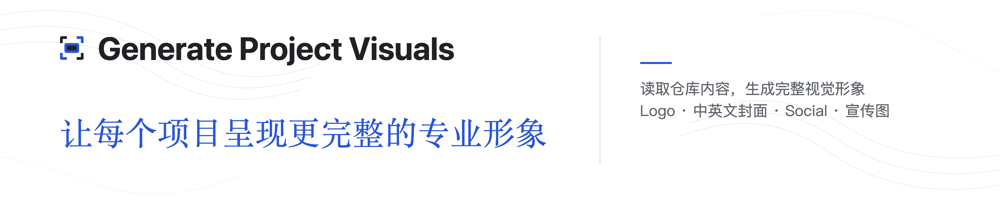

# 生成项目视觉资产

> English guide: [README.md](README.md)

<p align="center">
  <a href="LICENSE"></a>
  <a href="https://github.com/ascendho/Generate-Project-Visuals/releases/latest"></a>
  <a href="https://github.com/ascendho/Generate-Project-Visuals/stargazers"></a>
  <a href="https://github.com/ascendho/Generate-Project-Visuals/commits/master"></a>
  <a href=".github/workflows/release.yml"></a>
  <a href="plugins/generate-github-cover/skills/generate-github-cover/SKILL.md"></a>
</p>

<p align="center">
  
</p>

Generate Project Visuals 是一个 Codex Plugin 和可独立安装的 Skill。它会读取仓库并生成项目 Logo Mark、Logo Lockup、中英文 README 封面、`1280×640` Social Preview 和 `16:9` 宣传图。所有公开图片都按精确尺寸输出为 PNG；SVG 仅用于 Skill 内置模板和 `/tmp` 中的临时 Logo 方案。其它语言只在用户明确提出时生成。

项目品牌名为 **Generate Project Visuals**，稳定的 Plugin、Skill 和调用名称仍为 `generate-github-cover`。

## 安装

渲染器需要 Python 3.10+、Playwright、Segno 和 Chromium：

```sh
python -m pip install playwright segno
python -m playwright install chromium
```

### Codex Plugin（推荐）

```sh
codex plugin marketplace add ascendho/Generate-Project-Visuals --ref master
codex plugin add generate-github-cover@generate-project-visuals
```

安装后新建一个 Codex 会话，再调用 `$generate-github-cover` 或直接描述匹配的视觉生成任务。

### Skill Installer

在 Codex 中输入：

```text
请使用 $skill-installer，从 https://github.com/ascendho/Generate-Project-Visuals/tree/master/plugins/generate-github-cover/skills/generate-github-cover 安装这个 Skill
```

### 本地开发软链接

如果需要持续修改 Skill，可在仓库根目录运行以下命令，将仓库内的 Skill 链接到用户 Skill 目录：

```sh
mkdir -p "$HOME/.agents/skills"
ln -s "$PWD/plugins/generate-github-cover/skills/generate-github-cover" \
  "$HOME/.agents/skills/generate-github-cover"
```

之后本仓库中的修改会直接生效；要同步远端更新，只需在本仓库执行 `git pull`。如果 Codex 未识别更新，请新建会话或重启 Codex；移动仓库后需要重新创建软链接。

### Release 压缩包

从[最新 Release](https://github.com/ascendho/Generate-Project-Visuals/releases/latest)下载 `generate-github-cover-vX.Y.Z.zip`，使用 `.sha256` 文件校验后解压到用户 Skill 目录：

```sh
mkdir -p "$HOME/.agents/skills"
unzip generate-github-cover-vX.Y.Z.zip -d "$HOME/.agents/skills"
```

克隆整个仓库主要用于开发。根目录 README、工作流和项目展示图片不会进入独立 Skill 压缩包。

## 使用

```text
请使用 generate-github-cover skill，为当前 GitHub 项目生成或更新 Logo，以及中英文 Cover、Social Preview 和宣传图
```

Skill 会先读取仓库规则、README、包配置、入口代码、相关配置和现有视觉素材，再编写文案和选择视觉隐喻。默认只生成文件；只有用户明确提出时，才会同步 README、GitHub 设置、提交或远程仓库。

默认无后缀文件为英文，简体中文使用 `-zh`。用户明确指定语言集合时，该集合替换默认中英文；如需扩展默认集合，应明确要求“追加”或“保留”语言。

## 仓库结构

```text
assets/                          本项目展示与生成素材
plugins/generate-github-cover/  可安装的 Codex Plugin
  .codex-plugin/plugin.json
  skills/generate-github-cover/
    SKILL.md                     Agent 工作流
    scripts/                     渲染器与风格注册器
    references/                 新增风格说明
    styles/
      cover/clean-editorial/    Cover manifest、参考与模板
      logo/clean-geometric/     Logo manifest 与参考
.agents/plugins/marketplace.json
.github/workflows/release.yml    标签触发的自动发布流程
tools/package_skill.py           可复现 Skill 打包工具
```

可复用模板位于自包含 Skill 的 Cover 风格目录中，不再放在根 `assets/`。Cover 与 Logo 风格会被分别自动发现，因此未来新增风格只需添加新的 manifest 风格目录，不需要维护中央注册表。

## Cover 配置

在目标仓库创建 `assets/<repo-slug>-cover.json`。顶层保存项目身份，`locales` 保存全部可翻译的 Cover 和 Promo 文案：

```json
{
  "schema_version": 4,
  "cover_style": "clean-editorial",
  "logo_style": "clean-geometric",
  "repository_slug": "example-project",
  "project_name": "Example Project",
  "project_url": "https://github.com/owner/example-project",
  "logo_lockup": "example-project-logo-lockup.png",
  "default_locale": "en",
  "locales": {
    "en": {
      "language": "en",
      "cover": {
        "headline": "A concise editorial statement of the project's value.",
        "description_lines": ["A short concrete statement,", "completed on line two."]
      },
      "social_preview": {
        "headline": "A concise editorial statement of the project's value.",
        "description_lines": ["A longer supporting statement for the wider layout,", "completed naturally on line two."]
      },
      "promo": {
        "headline": "A concise statement for sharing the project.",
        "description_lines": ["A concrete supporting statement,", "completed naturally on line two."],
        "notice": "A short, accurate usage note",
        "cta": "View the project"
      }
    },
    "zh": {
      "language": "zh-CN",
      "cover": {
        "headline": "一句简洁的中文项目价值陈述",
        "description_lines": ["第一行简要说明项目能力，", "第二行自然完成同一句说明。"]
      },
      "social_preview": {
        "headline": "一句简洁的中文项目价值陈述",
        "description_lines": ["第一行完整说明项目定位与核心能力，", "第二行自然完成同一句说明。"]
      },
      "promo": {
        "headline": "一句适合分享的中文项目价值陈述",
        "description_lines": ["第一行具体说明项目能力，", "第二行自然完成同一句说明。"],
        "notice": "简短、准确的使用说明",
        "cta": "扫码查看项目"
      }
    }
  },
  "source_files": ["AGENTS.md", "README.md", "pyproject.toml", "src/example/cli.py"]
}
```

`source_files` 是来源记录，只填写已经读取并实际用于定位或文案的仓库相对路径；它不会让渲染器自动读取文件。不要加入秘密、缓存、生成物或无关文件。

Cover 是用于 README 的紧凑 `5:1` 横幅，输出尺寸为 `4000x800`；右栏的两行说明应保持简短。可选的 `social_preview` 与 `cover` 结构相同，缺省时回退到 `cover`；当保持 `1280x640` Social Preview 的较长文案时使用该字段。

## 渲染与校验

在本仓库开发时运行：

```sh
SKILL_DIR=plugins/generate-github-cover/skills/generate-github-cover

python "$SKILL_DIR/scripts/render_cover.py" render \
  assets/<repo-slug>-cover.json --output-dir assets --force

python "$SKILL_DIR/scripts/render_cover.py" validate \
  assets/<repo-slug>-cover.json --output-dir assets
```

默认语言生成 `<slug>-cover.png`、`<slug>-social-preview.png` 和 `<slug>-promo.png`；其它语言使用 `-<locale>` 后缀。文案修改统一写入 JSON 配置，并通过完整的 `render` 命令应用。

## 设计 Logo

先创建三个临时 Mark 方案，文件名固定为 `concept-a.svg`、`concept-b.svg` 和 `concept-c.svg`，然后生成预览：

```sh
SKILL_DIR=plugins/generate-github-cover/skills/generate-github-cover

python "$SKILL_DIR/scripts/render_logo.py" preview \
  --style clean-geometric \
  --project-name "Example Project" \
  --slug example-project \
  --input-dir /tmp/example-project-logo-source \
  --output-dir /tmp/example-project-logo-preview
```

用户明确选择后再渲染并校验：

```sh
SKILL_DIR=plugins/generate-github-cover/skills/generate-github-cover

python "$SKILL_DIR/scripts/render_logo.py" render \
  --style clean-geometric \
  --project-name "Example Project" \
  --slug example-project \
  --mark /tmp/example-project-logo-source/concept-a.svg \
  --output-dir assets

python "$SKILL_DIR/scripts/render_logo.py" validate \
  --style clean-geometric --slug example-project --output-dir assets
```

最终只生成透明 `1024×1024` Mark PNG 和透明 `3200×800` Lockup PNG；临时方案 SVG 始终保留在 `/tmp`。

## 自动发布

`tools/package_skill.py` 会校验 Plugin 版本和 Skill 内容，生成可复现 ZIP 与 SHA-256 校验文件。推送语义化版本标签后，GitHub Actions 会自动发布两份文件：

```sh
# 先将 plugin.json 更新为同一语义化版本并提交。
git tag v0.2.0
git push origin v0.2.0
```

## 分享图片中的链接

PNG 等位图不能包含可点击区域，因此宣传图会同时显示仓库地址和二维码。在网页中需要点击跳转时，应使用普通链接包裹图片。

## 许可证

本项目采用 [MIT License](LICENSE)。
